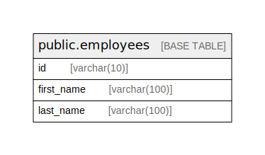

# employeedb

## 概要

従業員管理 API におけるスキーマ

## テーブル一覧

| 名前 | カラム一覧 | コメント | タイプ |
| ---- | ------- | ------- | ---- |
| [public.employees](public.employees.md) | 3 | 従業員テーブルです。 | BASE TABLE |

## ER 図

---

> Generated by [tbls](https://github.com/k1LoW/tbls)
