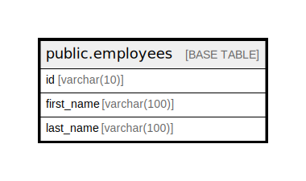

# public.employees

## 概要

従業員テーブルです。

## カラム一覧

| 名前 | タイプ | デフォルト値 | Nullable | 子テーブル | 親テーブル | コメント |
| ---- | ------ | ------------ | -------- | ---------- | ---------- | -------- |
| id | varchar(10) |  | false |  |  | 従業員を一意に特定する ID |
| first_name | varchar(100) |  | true |  |  | 従業員の名 |
| last_name | varchar(100) |  | true |  |  | 従業員の姓 |

## 制約一覧

| 名前 | タイプ | 定義 | コメント |
| ---- | ---- | ---------- | ------- |
| employees_pkey | PRIMARY KEY | PRIMARY KEY (id) | 主キー |

## INDEX 一覧

| 名前 | 定義 | コメント |
| ---- | ---------- | ------- |
| employees_pkey | CREATE UNIQUE INDEX employees_pkey ON public.employees USING btree (id) | 主キーインデックス |

## ER 図

---

> Generated by [tbls](https://github.com/k1LoW/tbls)
